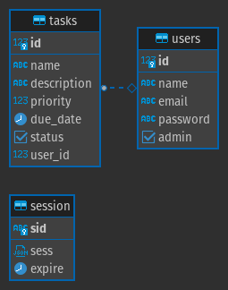
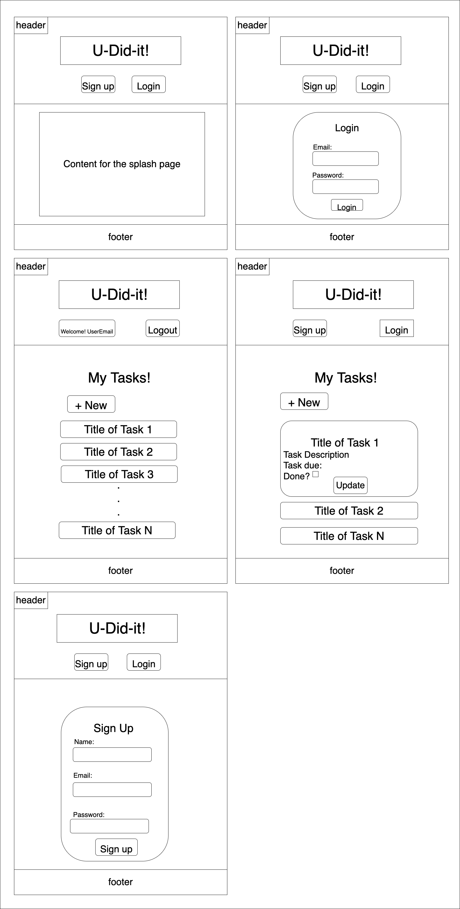

# Laminar
GA Project 3 - To do list | Planner

See it live [here](https://laminar-tasks.herokuapp.com)

## Description
The project is a Todo list that tracks pending tasks in a nice visually pleasing Interface.
The goal is to have a simple inviting UI where users can quickly navigate through the list of pending tasks and 

## User Stories
**End User: John**
> Sign up
- John wants to create a list of tasks
- John goes to the application and registers by providing name, email and password
- Upon sign up, a session is created and John finds looking at the dashboard which shows no lists as it is his first time signing in

> Create task
-   John clicks on the button `+ New`
-   John fills in the `create new task` form by providing:
    -   Task Name
    -   Description
    -   Priority (by color)
    -   Due date (optional)
-   John clicks `Create Task`
-   John can now see the task that he created color coded based on the priority selected

> Update task
-   John clicks on the task in the `dashboard`
-   John sees the details of the task and clicks on `update`
-   Modal pops up with the details pre-filled and editable
-   John makes the required modifications and saves the task
-   John can now see the updated task

> Complete task
-   John clicks on the task in the `dashboard`
-   John checks the checkbox labeled as `done`
-   The task disappears from the view

> Delete task
-   John clicks on the task in the `dashboard`
-   John clicks on `delete` button
-   John confirms the deletion on the confirmation modal

> Log out
- John is done working on his list for today
- John clicks on `logout` button and is taken back to the landing page

## Database Diagram

## Installation instructions
> npm and a postgres DB are required to run this application

**DB**

To create the schema:
- Create a new database to host the data
- Note the database name
- Connect to the database using a SQL editor (`psql` or Dbeaver are recommended)
- Run the SQL statements in `schema.sql`
- If running in DEV mode:
  - Update the file `database/db.js`
  - Change line 13 to the name of the database
- If running in Production mode:
  - Add the variable `DATABASE_URL` to a `.env` file that will be read when the server starts

**Web Server**
- Clone the repository locally using `git clone`
- Change directories into the downloaded repository
- Run `npm i` to install the necessary dependencies
- Create a `.env` file if not created and add the variable `SESSION_SECRET` and add a random value to encrypt the session data
- To run the server:
  - Development: `npm run start:test`
  - Production: `NODE_ENV=production npm run start`
- Go to `localhost:3000`

**Tailwind CSS compilation**
- To compile Tailwind CSS: `npm run build-css`

## Technologies used:
- npm
- express.js
- JavaScript
- Tailwind

## Wireframe and sketches

## Roadmap and things to come...
- Using time in due dates
- Using locale time in due dates
- Task reminder notifications
- Email integrations
- Calendar to see the tasks
- Project Planner
- Ability to share task ownership with other users
- Optimize for a mobile experience